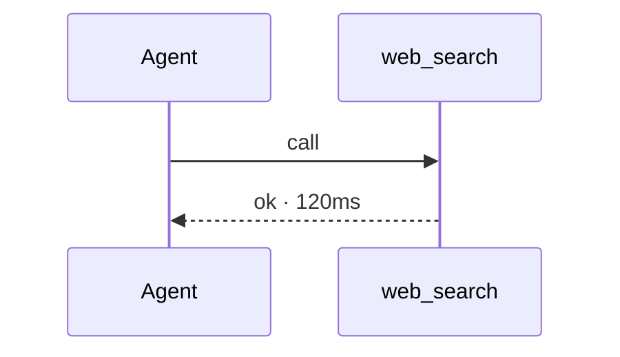

# toolflow

**Offline CLI that turns agent tool-call JSONL into Mermaid sequence diagrams and a compact summary table.**

Most agent tooling either *runs* agents or diffs raw transcript text. `toolflow` reconstructs **tool-call topology** from heterogeneous JSONL event shapes (OpenAI-style `tool_calls`, Anthropic-style `tool_use` / `tool_result`, and generic `{event:tool_call}`) into a Mermaid flow plus per-tool stats — so you can debug and compare agent runs without calling an LLM.

## Why it is novel

- Focuses on **tool topology**, not chat prose.
- **Shape-liberal** parser: mix vendor log formats in one file.
- Args are shown as short **content digests** (not full payloads), which keeps diagrams readable and safer to share.
- Fully **offline**, stdlib-only runtime, MIT.

Distinct from related experiments like sandclock (timebox + FS delta), tokpack (context packing), hushdiff (secret masking), runseal (run receipts), and rippleguard (static exec-surface mapping).

## Install

```bash
pip install -e .
# or with tests:
pip install -e ".[dev]"
```

Requires Python 3.10+.

## Quick demo

```bash
toolflow render examples/sample.jsonl
toolflow summarize examples/sample.jsonl
toolflow render examples/sample.jsonl --out /tmp/toolflow-out
```

Example Mermaid fragment:



## JSONL shapes accepted

Any of (one JSON object per line; bad lines skipped):

```json
{"type":"tool_use","name":"search","input":{"q":"…"},"duration_ms":120}
{"type":"tool_result","name":"search","is_error":false}
{"tool_calls":[{"function":{"name":"read","arguments":"{\"path\":\"x\"}"}}]}
{"role":"tool","name":"read","ok":true,"latency_ms":15}
{"event":"tool_call","tool":"shell","args":{"cmd":"ls"}}
```

Optional timing fields: `duration_ms`, `latency_ms`, `elapsed_ms`, or `started_at` / `ended_at` ISO timestamps.

## CLI

```
toolflow render PATH.jsonl [--format mermaid|summary|both] [--out DIR] [--max-steps N]
toolflow summarize PATH.jsonl
```

## License

MIT © 2026 Rashed Hasan
